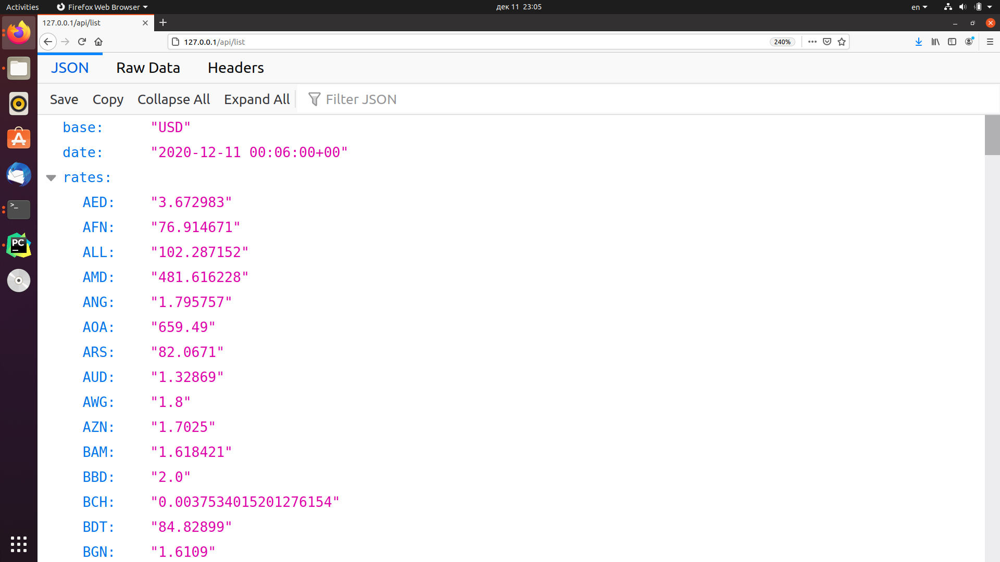

### Задание №2: сделать запуск сервиса при помощи systemd/supervisor  

В рамках этого задания реализован игрушечный сервис по обмену валют.  
Сделано 2 сервиса:
*  сервис зашедуленного обновления информации об обмене валют (с USD в остальные), обновление каждую минуту;
*  Flask REST API с одним GET-методом: `/api/list` (получение данных с обменника).

Ниже приложен скриншот использование игрушечного сервиса для получения 
  

Для запуска в Docker необходимо проделать следующее:
```
~/$ docker build -t devops-task2 .
~/$ docker run --name devops-task2-container -p 80:8080 -it devops-task2
```

